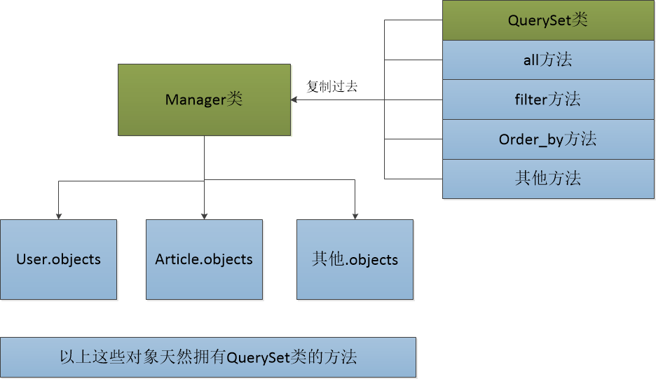

# QuerySet API

我们通常做查询操作的时候，都是通过 `模型名字.objects` 的方式进行操作。其实 `模型名字.objects` 是一个 `django.db.models.manager.Manager` 对象，而 `Manager` 这个类是一个“空壳”的类，他本身是没有任何的属性和方法的。他的方法全部都是通过 `Python`动态添加的方式，从 `QuerySet`类中拷贝过来的。示例图如下：

所以我们如果想要学习 `ORM`模型的查找操作，必须首先要学会 `QuerySet`上的一些 API 的使用。

## 返回新的QuerySet方法

在使用 `QuerySet`进行查找操作的时候，可以提供多种操作。比如过滤完后还要根据某个字段进行排序，那么这一系列的操作我们可以通过一个非常流畅的 `链式调用` 的方式进行。比如要从文章表中获取标题为 `123`，并且提取后要将结果根据发布的时间进行排序，那么可以使用以下方式来完
成：
```python
    articles = Article.objects.filter(title='123').order_by('create_time')
```
可以看到 `order_by`方法是直接在 `filter`执行后调用的。这说明 `filter`返回的对象是一个拥有 `order_by`方法的对象。而这个对象正是一个新的 `QuerySet`对象。因此可以使用 `order_by`方法。
那么以下将介绍在那些会返回新的 `QuerySet`对象的方法。
1. `filter`：将满足条件的数据提取出来，返回一个新的 `QuerySet`。具体的 filter 可以提供什么条件查询。请见查询操作章节。
2. `exclude`：排除满足条件的数据，返回一个新的 `QuerySet`。示例代码如下：
```python
Article.objects.exclude(title__contains='hello')
```
以上代码的意思是提取那些标题不包含 `hello`的图书。
3. `annotate`：给 `QuerySet`中的每个对象都添加一个使用查询表达式（聚合函数、F表达式、Q表达式、Func表达式等）的新字段。示例代码如下：
```python
    articles = Article.objects.annotate(author_name=F("author__name"))
```
以上代码将在每个对象中都添加一个 author__name 的字段，用来显示这个文章的作者的年龄。
4. `order_by`：指定将查询的结果根据某个字段进行排序。如果要倒叙排序，那么可以在这个字段的前面加一个**负号**。示例代码如下：
```python
    # 根据创建的时间正序排序
    articles = Article.objects.order_by("create_time")
    # 根据创建的时间倒序排序
    articles = Article.objects.order_by("-create_time")
    # 根据作者的名字进行排序
    articles = Article.objects.order_by("author__name")
    # 首先根据创建的时间进行排序，如果时间相同，则根据作者的名字进行排序
    articles = Article.objects.order_by("create_time",'author__name')
    # 一定要注意的一点是，多个 order_by ，会把前面排序的规则给打乱，而使用后面的排序方式。比如以下代码：
    articles = Article.objects.order_by("create_time").order_by("author__name")
```
他会根据作者的名字进行排序，而不是使用文章的创建时间。
5. `values`：用来指定在提取数据出来，需要提取哪些字段。默认情况下会把表中所有的字段全部都提取出来，可以使用 `values`来进行指定，并且使用了 `values`方法后，提取出的 `QuerySet`中的数据类型不是模型，而是在 `values`方法中指定的字段和值形成的字典：
```python
articles = Article.objects.values("title",'content')
for article in articles:
print(article)
```
以上打印出来的 `article`是类似于 `{"title":"abc","content":"xxx"}` 的形式。如果在 `values`中没有传递任何参数，那么将会返回这个恶模型中所有的属性。
6. `values_list`：类似于`values`。只不过返回的QuerySet`中，存储的不是字典，而是元组。示例代码如下：
```python
    articles = Article.objects.values_list('id','title')
    print(articles)
```
那么在打印`arthcles`后，结果为`<QuerySet [(1,'abc'),(2,'xxx',...)]>`等。如果在`values_list`中只有一个字段。那么你可以传递`flat=True`来将结果扁平化。示例代码如下:
```python
    articles1 = Article.objects.values_list('title')
    >> <QuerySet [('abc'),('xxx'),...]
    
    articles2 = Arctile.objects.values_list('title',flat=True)
    >> <QuerySet ['abc','xxx',...]>
```
7. `all`：获取这个`ORM`模型的`QuerySet`对象。
8. `select_related`：在提取某个模型的数据的同量，也提前将相关联的数据提取出来。比如提取文章数据，可成为个体`select_related`将`author`信息提取出来，以后再次使用`article.author`的时候就不需要再次去访问数据库了。可以减少数据库查询的次数。示例代码如下：
```python
    article = Article.objects.get(pk=1)
    >> article.author  # 重新执行一次查询语句
    
    article = Article.objects.select_related('author').get(pk=2)
    >> article.author # 不需要重新执行查询语句了。
```