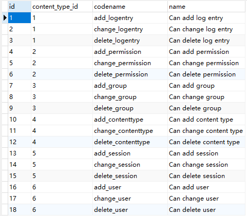

## 权限和分组

###登录

在使用`authenticate`进行验证后，如果验证通过了。那么会返回一个`user`对象，拿到`user`对象后，可以使用`django.contrib.auth.login`进行登录。示例代码如下：
```python
    user = authenticate(username=username, password=password)
    if user is not None:
    if user.is_active:
        login(request, user)
```

### 注销

注销，或者说退出登录。我们可以通过`django.contrib.auth.logout`来实现。他会清理掉这个用户的`session`数据。


### 登录限制

有时候，某个视图函数是需要经过登录后才能访问的。那么我们可以通过`django.contrib.auth.decorators.login_required`装饰器来实现。示例代码如下:
```python
    from django.contrib.auth.decorators import login_required

    # 在验证失败后，会跳转到/accounts/login/这个url页面
    @login_required(login_url='/accounts/login/')
    def my_view(request):
        pass
```

### 权限

`Django`中内置了权限的功能。他的权限都是针对表或者说是模型级别的。比如对某个模型上的数据是否可以进行增删改查操作。他不能针对数据级别的，比如对某个表中的某条数据能否进行增删改查操作（如果要实现数据级别的，考虑使用django-guardian）。创建完一个模型后，针对这个模型默认就有三种权限，分别是增/删/改/。可以在执行完`migrate`命令后，查看数据库中的`auth_permission`表中的所有权限。


