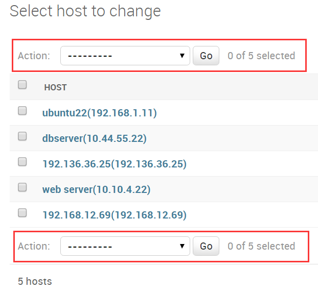
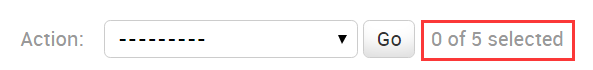
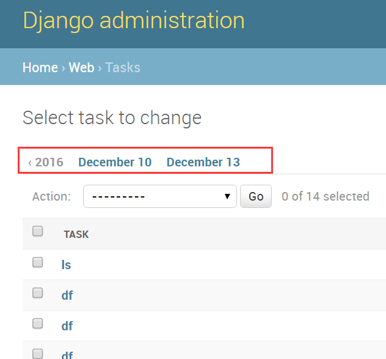
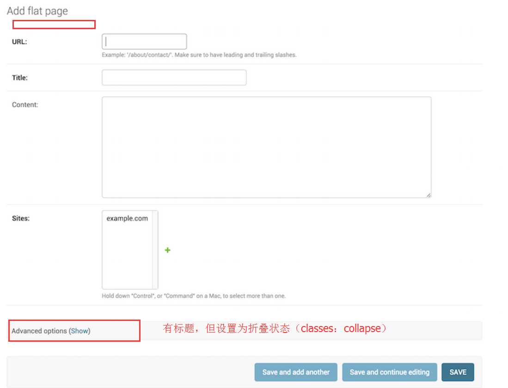

## 自定制Admin

如果只是在admin中简单的展示及管理模型，那么在admin.py模块中使用admin.site.register将模型注册一下就好了：
```python
from django.contrib import admin
from myproject.myapp.models import Author

admin.site.register(Author)
```
但是，很多时候这远远不够，我们需要对admin进行各种深度定制，以满足我们的需求。

这就要使用Django为我们提供的`ModelAdmin`类了。

`ModelAdmin`类是一个模型在admin页面里的展示方法，如果你对默认的admin页面满意，那么你完全不需要定义这个类，直接使用最原始的样子也行。通常，它们保存在app的admin.py文件里。下面是个简单的例子：
```python
from django.contrib import admin
from myproject.myapp.models import Author

# 创建一个ModelAdmin的子类
class AuthorAdmin(admin.ModelAdmin):
    pass

# 注册的时候，将原模型和ModelAdmin耦合起来
admin.site.register(Author, AuthorAdmin)
```

---

### 一、注册装饰器

除了常用的`admin.site.register(Author, AuthorAdmin)`方式进行注册，还可以用装饰器的方式连接模型和`ModelAdmin`。如下所示：
```python
from django.contrib import admin
from .models import Author

@admin.register(Author)
class AuthorAdmin(admin.ModelAdmin):
    pass
```
这个装饰器可以接收一些模型类作为参数，以及一个可选的关键字参数site（如果你使用的不是默认的AdminSite），比如。
```python
from django.contrib import admin
from .models import Author, Reader, Editor
from myproject.admin_site import custom_admin_site

@admin.register(Author, Reader, Editor, site=custom_admin_site)
class PersonAdmin(admin.ModelAdmin):
    pass
```

---

### 二、 搜索admin文件

当你在`INSTALLED_APPS`设置中添加了`django.contrib.admin`后，Django将自动在每个应用中搜索`admin`模块并导入它。也就是说，通常我们在每个`app`下都有一个`admin.py`文件，将当前`app`和`admin`有关的内容写到内部的`admin.py`文件中就可以了，Django会自动搜索并应用它们。
    + class apps.AdminConfig：admin默认的`AppConfig`类，当Django启动时自动调用其`autodiscover()`方法
    + class apps.SimpleAdminConfig：和上面的类似，但不调用`autodiscover()`
    + autodiscover()：自动搜索admin模块的方法。在使用自定义的site时，必须禁用这个方法，你应该在`INSTALLED_APPS`设置中用`django.contrib.admin.apps.SimpleAdminConfig`替代`django.contrib.admin`
    

---

### 三、ModelAdmin的属性

真正用来定制admin的手段，大部分都集中在这些ModelAdmin内置的属性上。
ModelAdmin非常灵活，它有许多内置属性，帮助我们自定义admin的界面和功能。所有的属性都定义在ModelAdmin的子类中，如下方式：
```python
from django.contrib import admin

class AuthorAdmin(admin.ModelAdmin):
    date_hierarchy = 'pub_date'
```

1. ModelAdmin.actions
一个列表，包含自定义的actions，后面有专门的叙述。

2. ModelAdmin.actions_on_top
是否在列表上方显示actions的下拉框，默认为True

3. ModelAdmin.actions_on_bottom
是否在列表下方显示actions的下拉框，默认为False。效果看下面的图片，没什么大用途。


4. ModelAdmin.actions_selection_counter
是否在actions下拉框右侧显示选中的对象的数量，默认为True，可改为False。


5. ModelAdmin.date_hierarchy
根据你指定的日期相关的字段，为页面创建一个时间导航栏，可通过日期过滤对象。例如：
```python
date_hierarchy = 'pub_date'
```  
它的效果看起来是这样的：


6. ModelAdmin.empty_value_display
指定空白显示的内容。如果你有些字段没有值（例如None，空字符串等等），默认情况下会显示破折号“-”。这个选项可以让你自定义显示什么，如下例就显示为`-empty-`：
```python
from django.contrib import admin

class AuthorAdmin(admin.ModelAdmin):
    empty_value_display = '-empty-'
```
你还可以为整个admin站点设置默认空白显示值，通过设置`AdminSite.empty_value_display="xxxxxxx"`。甚至为某个函数设置空白值，如下：
```python
from django.contrib import admin

class AuthorAdmin(admin.ModelAdmin):
    fields = ('name', 'title', 'view_birth_date')

    def view_birth_date(self, obj):
        return obj.birth_date
    # 注意下面这句
    view_birth_date.empty_value_display = '???'
```

7. ModelAdmin.exclude
不显示指定的某些字段。如下例有这么个模型：
```python
from django.db import models

class Author(models.Model):
    name = models.CharField(max_length=100)
    title = models.CharField(max_length=3)
    birth_date = models.DateField(blank=True, null=True)
```
如果你不希望在页面内显示birth_date字段，那么这么设置：
```python
from django.contrib import admin

class AuthorAdmin(admin.ModelAdmin):
    fields = ('name', 'title')
```
和这么设置是一样的：
```python
from django.contrib import admin

class AuthorAdmin(admin.ModelAdmin):
    # 一定注意了，值是个元组！一个元素的时候，最后的逗号不能省略。
    exclude = ('birth_date',)
```

8. ModelAdmin.fields
按你希望的顺序，显示指定的字段。与`exclude`相对。但要注意与`list_display`区分。这里有个小技巧，你可以通过组合元组的方式，让某些字段在同一行内显示，例如下面的做法`url`和`title`将在一行内，而`content`则在下一行。
```python
class FlatPageAdmin(admin.ModelAdmin):
    fields = (('url', 'title'), 'content')
```
如果没有对`field`或`fieldsets`选项进行定义，那么Django将按照模型定义中的顺序，每一行显示一个字段的方式，逐个显示所有的非`AutoField`和`editable=True`的字段。（自动字段，如主键，不可编辑字段是不会出现在页面里的。）

9. ModelAdmin.fieldsets
这个功能其实就是根据字段对页面进行分组显示或布局了。`fieldsets`是一个二元元组的列表。每个二元元组代表一个`<fieldset>`，是整个form的一部分。

二元元组的格式为(`name`,`field_options`)，`name`是一个表示该`filedset`标题的字符串，`field_options`是一个包含在该`filedset`内的字段列表。

下面是一个例子，有助于你理解：
```python
from django.contrib import admin

class FlatPageAdmin(admin.ModelAdmin):
    fieldsets = (
        (None, {
            'fields': ('url', 'title', 'content', 'sites')
        }),
        ('Advanced options', {
            'classes': ('collapse',),
            'fields': ('registration_required', 'template_name'),
        }),
    )
```
它的页面看起来像下面的样子：


在`filed_options`字典内，可以使用下面这些关键字：

**fields**：一个必填的元组，包含要在`fieldset`中显示的字段。例如：
```python
{
'fields': ('first_name', 'last_name', 'address', 'city', 'state'),
}
```
同样，它也可以像前面那样通过组合元组，实现多个字段在一行内的效果：
```pyhon
{
'fields': (('first_name', 'last_name'), 'address', 'city', 'state'),
}
```
`fileds`可以包含`readonly_fields`的值，作为只读字段。

`classes`：一个包含额外的CSS类的元组，例如：
```python
{
'classes': ('wide', 'extrapretty'),
}
```
两个比较有用的样式是collaspe和wide，前者将fieldsets折叠起来，后者让它具备更宽的水平空间。

description：一个可选的额外的说明文本，放置在每个fieldset的顶部。但是，这里并没有对description的HTML语法进行转义，因此可能有时候会造成一些莫名其妙的显示，要忽略HTML的影响，请使用django.utils.html.escape()手动转义。