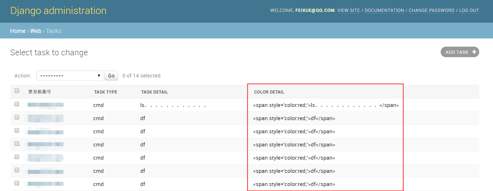
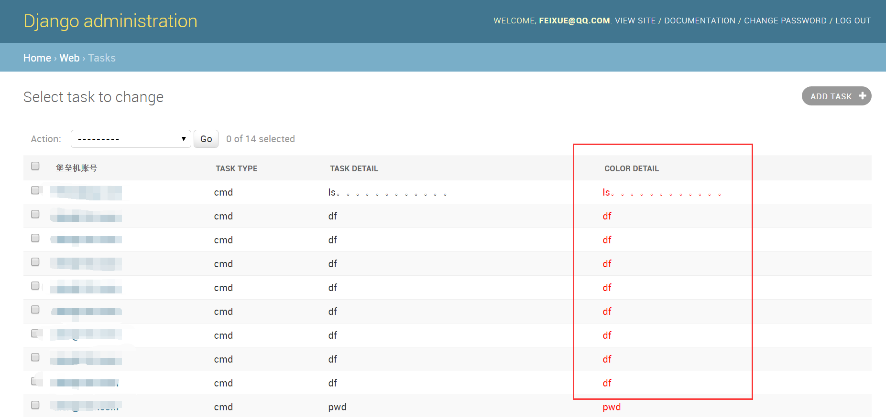
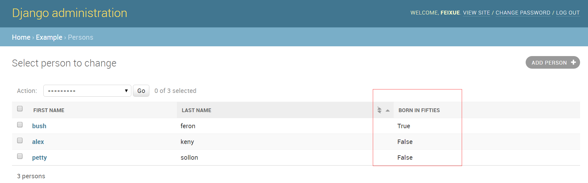
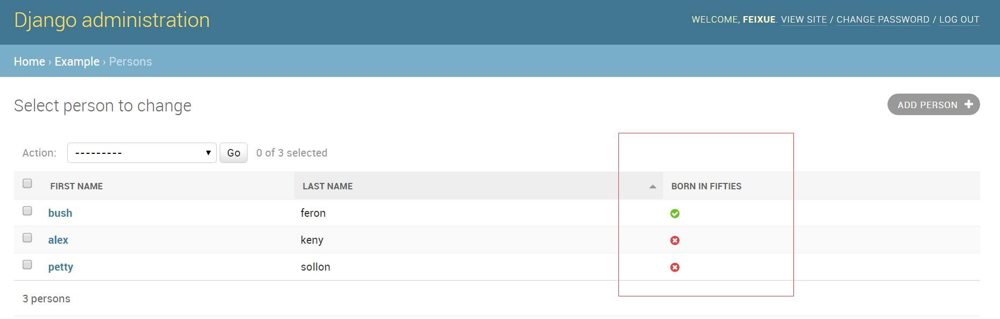
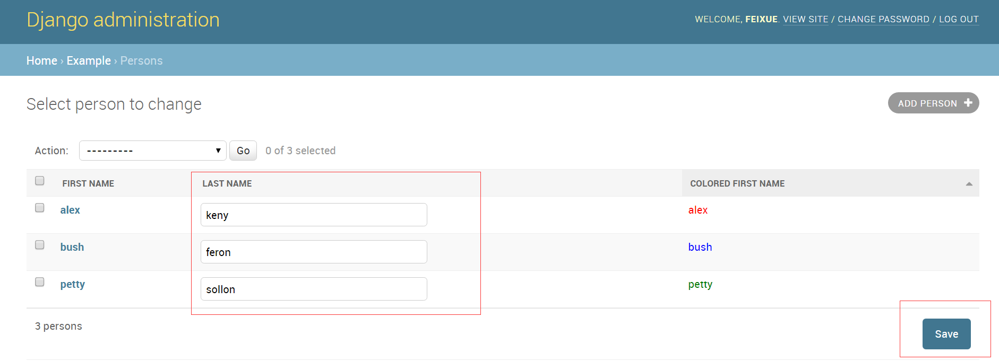

### 三、ModelAdmin属性

15 . 指定显示在修改页面上的字段。这是一个很常用也是最重要的技巧之一。例如：
```python
list_display = ('first_name', 'last_name')
```
如果你不设置这个属性，admin站点将只显示一列，内容是每个对象的`__str__()`(Python2使用`__unicode__()`)方法返回的内容。

在list_display中，你可以设置四种值：
    + 模型的字段名
    ```python
    class PersonAdmin(admin.ModelAdmin):
    list_display = ('first_name', 'last_name')
    ```
    + 一个函数，它接收一个模型实例作为参数
    ```python
    def upper_case_name(obj):
        return ("%s %s" % (obj.first_name, obj.last_name)).upper()
    upper_case_name.short_description = 'Name'

    class PersonAdmin(admin.ModelAdmin):
        list_display = (upper_case_name,)
    ```
    + 一个表示ModelAdmin的某个属性的字符串
    类似上面的函数调用，通过反射获取函数名，换了种写法而已，例如：
    ```python
    class PersonAdmin(admin.ModelAdmin):
        list_display = ('upper_case_name',)

        def upper_case_name(self, obj):
            return ("%s %s" % (obj.first_name, obj.last_name)).upper()
        upper_case_name.short_description = 'Name'
    ```
    + 一个表示模型的某个属性的字符串
    类似第二种，但是此处的self是模型实例，引用的是模型的属性。参考下面的例子：
    ```python
    from django.db import models
    from django.contrib import admin
    
    class Person(models.Model):
        name = models.CharField(max_length=50)
        birthday = models.DateField()
    
        def decade_born_in(self):
            return self.birthday.strftime('%Y')[:3] + "0's"
        decade_born_in.short_description = 'Birth decade'
    
    class PersonAdmin(admin.ModelAdmin):
        list_display = ('name', 'decade_born_in')
    ```
    下面是对list_display属性的一些特别提醒：
        + 对于Foreignkey字段，显示的将是其`__str__()`方法的值。
        + 不支持ManyToMany字段。如果你非要显示它，请自定义方法。
        + 对于BooleanField或NullBooleanField字段，会用on/off图标代替True/False。
        + 如果给list_display提供的值是一个模型的、ModelAdmin的或者可调用的方法，默认情况下会自动对返回结果进行HTML转义，这可能不是你想要的。
    下面是一个完整的例子：
    
    ```python
    from django.db import models
    from django.contrib import admin
    from django.utils.html import format_html
    
    class Person(models.Model):
        first_name = models.CharField(max_length=50)
        last_name = models.CharField(max_length=50)
        color_code = models.CharField(max_length=6)
    
        def colored_name(self):
            # 关键是这句！！！！！请自己调整缩进。
            return '<span style="color: #%s;">%s %s</span>'%(
                self.color_code,
                self.first_name,
                self.last_name,
            )
    class PersonAdmin(admin.ModelAdmin):
        list_display = ('first_name', 'last_name', 'colored_name')
    ```
    
    实际的效果如下图所示：
    
    
    很明显，你是想要有个CSS效果，但Django把它当普通的字符串了。怎么办呢？用`format_html()`或者`format_html_join()`或者`mark_safe()`方法！
    
    ```python
    from django.db import models
    from django.contrib import admin
    # 需要先导入！
    from django.utils.html import format_html
    
    class Person(models.Model):
        first_name = models.CharField(max_length=50)
        last_name = models.CharField(max_length=50)
        color_code = models.CharField(max_length=6)
    
        def colored_name(self):
            # 这里还是重点，注意调用方式，‘%’变成‘{}’了！
            return format_html(
                '<span style="color: #{};">{} {}</span>',
                self.color_code,
                self.first_name,
                self.last_name,
            )
    
    class PersonAdmin(admin.ModelAdmin):
        list_display = ('first_name', 'last_name', 'colored_name')
    ```
    下面看起来就会是你想要的结果了：
    
    
    
    + 如果某个字段的值为None或空字符串或空的可迭代对象，那么默认显示为短横杠“-”，你可以使用`AdminSite.empty_value_display`在全局改写这一行为：
    ```python
    from django.contrib import admin

    admin.site.empty_value_display = '(None)'
    ```
    或者使用`ModelAdmin.empty_value_display`只改变某个类的行为：
    ```python
    class PersonAdmin(admin.ModelAdmin):
        empty_value_display = 'unknown'
    ```
    或者更细粒度的只改变某个字段的这一行为：
    ```python
    class PersonAdmin(admin.ModelAdmin):
        list_display = ('name', 'birth_date_view')
    
        def birth_date_view(self, obj):
             return obj.birth_date
    
        birth_date_view.empty_value_display = 'unknown'
    ```
    + 默认情况下，一个返回布尔值的方法在list_display中显示为True或者False的：
    
    但如果你给这个方法添加一个boolean的属性并赋值为True，它将显示为on/off的图标，如下图：
    ```python
    from django.db import models
    from django.contrib import admin
    
    class Person(models.Model):
        first_name = models.CharField(max_length=50)
        birthday = models.DateField()
    
        def born_in_fifties(self):
            return self.birthday.strftime('%Y')[:3] == '195'
        # 关键在这里
        born_in_fifties.boolean = True
    
    class PersonAdmin(admin.ModelAdmin):
        # 官方文档这里有错，将'name'改为'first_name' 
        list_display = ('first_name', 'born_in_fifties')
    ```
    
    
    + 通常情况下，在list_display列表里的元素如果不是数据库内的某个具体字段，是不能根据它进行排序的。但是如果给这个字段添加一个admin_order_field属性，并赋值一个具体的数据库内的字段，则可以按这个字段对原字段进行排序，如下所示：
    ```python
    from django.db import models
    from django.contrib import admin
    from django.utils.html import format_html
    
    class Person(models.Model):
        first_name = models.CharField(max_length=50)
        color_code = models.CharField(max_length=6)
    
        def colored_first_name(self):
            return format_html(
                '<span style="color: #{};">{}</span>',
                self.color_code,
                self.first_name,
            )
        # 就是这一句了！
        colored_first_name.admin_order_field = 'first_name'
    
    class PersonAdmin(admin.ModelAdmin):
        list_display = ('first_name', 'colored_first_name')
    ```
    本来colored_first_name是不能排序的，给它的admin_order_field赋值first_name后，就依托first_name进行排序了。

    要降序的话，使用连字符“-”前缀：
    ```python
    colored_first_name.admin_order_field = '-first_name'
    ```
    还可以跨表跨关系引用：
    ```python
    class Blog(models.Model):
        title = models.CharField(max_length=255)
        author = models.ForeignKey(Person, on_delete=models.CASCADE)
    
    class BlogAdmin(admin.ModelAdmin):
        list_display = ('title', 'author', 'author_first_name')
    
        def author_first_name(self, obj):
            return obj.author.first_name
        # 指定了另一张表的first_name作为排序的依据
        author_first_name.admin_order_field = 'author__first_name'
    ```
    + list_display里的元素还可以是某个属性。但是请注意的是，如果使用python的@property方式来构造一个属性，则不能给它添加short_description描述，只有使用property()函数的方法构造属性的时候，才可以添加short_description描述，如下：
    ```python
    class Person(models.Model):
        first_name = models.CharField(max_length=50)
        last_name = models.CharField(max_length=50)
    
        def my_property(self):
            return self.first_name + ' ' + self.last_name
        my_property.short_description = "Full name of the person"
    
        full_name = property(my_property)
    
    class PersonAdmin(admin.ModelAdmin):
        list_display = ('full_name',)
    ```
    + list_display中的每个字段名在HTML中都将自动生成CSS类属性，在th标签中以column-<field_name>的格式，    
    + 你可以通过它，对前端进行自定义或调整，例如设置宽度等等。
    + Django将按下面的顺序，解释list_display中的每个元素：
    + 模型的字段
    + 可调用对象
    + ModelAdmin的属性
    + 模型的属性
    
16 . ModelAdmin.list_display_links
指定用于链接修改页面的字段。通常情况，list_display列表中的第一个元素被作为指向目标修改页面的超级链接点。但是，使用list_display_links可以帮你修改这一默认配置。
如果设置为None，则根本没有链接了，你无法跳到目标的修改页面。或者设置为一个字段的元组或列表（和list_display的格式一样），这里面的每一个元素都是一个指向修改页面的链接。你可以指定和list_display一样多的元素个数，Django不关系它的多少。唯一需要注意的是，如果你要使用list_display_links，你必须先有list_display。
下面这个例子中first_name和last_name都可以点击并跳转到修改页面。
```python
class PersonAdmin(admin.ModelAdmin):
    list_display = ('first_name', 'last_name', 'birthday')
    list_display_links = ('first_name', 'last_name')
```
而如果这样，你将没有任何链接：
```python
class AuditEntryAdmin(admin.ModelAdmin):
    list_display = ('timestamp', 'message')
    list_display_links = None
```

17 . ModelAdmin.list_editable
这个选项是让你指定在修改列表页面中哪些字段可以被编辑。指定的字段将显示为编辑框，可修改后直接批量保存，如下图：


在这里，我们将`last_name`设置为了`list_editable`。

需要注意的是：一是不能将`list_display`中没有的元素设置为`list_editable`，二是不能将`list_display_links`中的元素设置为`list_editable`。原因很简单，你不能编辑没显示的字段或者作为超级链接的字段。
