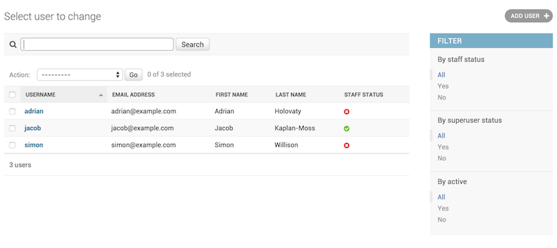
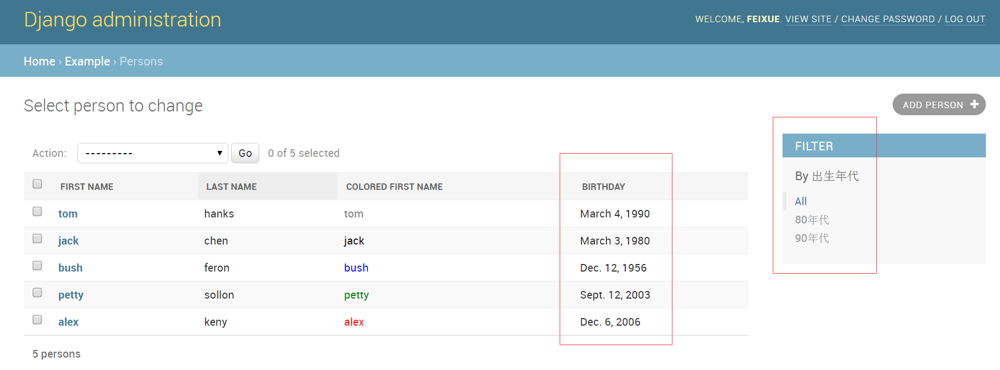
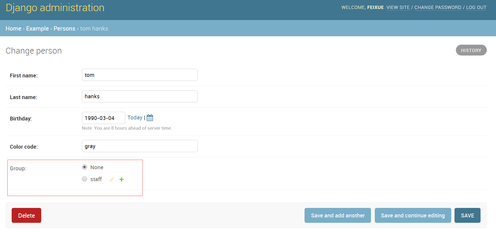
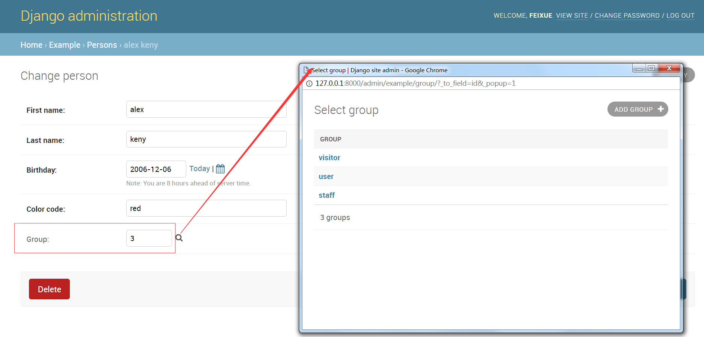
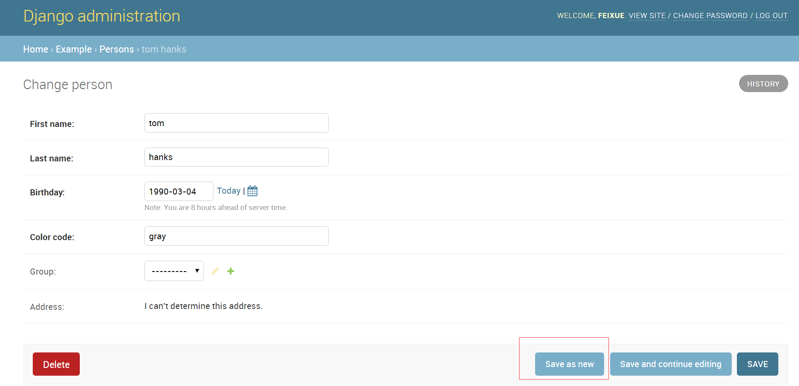
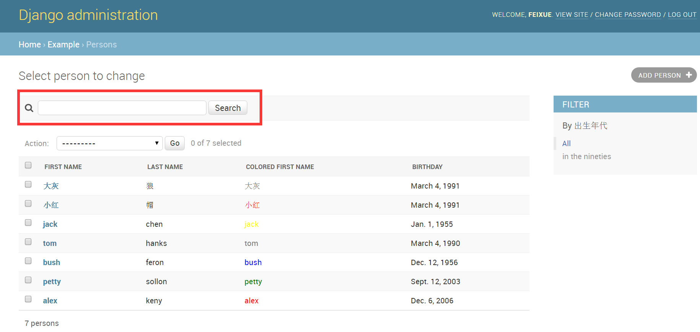
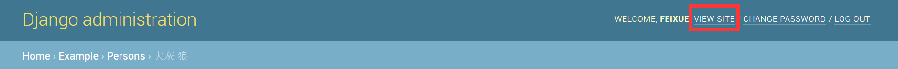

### 三、ModelAdmin属性

18 . ModelAdmin.list_filter
设置`list_filter`属性后，可以激活修改列表页面的右侧边栏，用于对列表元素进行过滤，如下图：


list_filter必须是一个元组或列表，其元素是如下类型之一：
    + 某个字段名，但该字段必须是BooleanField、CharField、DateField、DateTimeField、IntegerField、ForeignKey或者ManyToManyField中的一种。例如：
    ```python
    class PersonAdmin(admin.ModelAdmin):
        list_filter = ('is_staff', 'company')
    ```
    在这里，你可以利用双下划线进行跨表关联，如下例：
    ```python
    class PersonAdmin(admin.UserAdmin):
        list_filter = ('company__name',)
    ```
    
    + 一个继承django.contrib.admin.SimpleListFilter的类。你要给这个类提供title和parameter_name的值，并重写lookups和queryset方法。例如：
    
    ```python
    from datetime import date
    from django.contrib import admin
    from django.utils.translation import ugettext_lazy as _
    
    class DecadeBornListFilter(admin.SimpleListFilter):
        # 提供一个可读的标题
        title = _('出生年代')
    
        # 用于URL查询的参数.
        parameter_name = 'decade'
    
        def lookups(self, request, model_admin):
            """
            返回一个二维元组。每个元组的第一个元素是用于URL查询的真实值，
            这个值会被self.value()方法获取，并作为queryset方法的选择条件。
            第二个元素则是可读的显示在admin页面右边侧栏的过滤选项。        
            """
            return (
                ('80s', _('80年代')),
                ('90s', _('90年代')),
            )
            
        def queryset(self, request, queryset):
            """
            根据self.value()方法获取的条件值的不同执行具体的查询操作。
            并返回相应的结果。
            """
            if self.value() == '80s':
                return queryset.filter(birthday__gte=date(1980, 1, 1),
                                        birthday__lte=date(1989, 12, 31))
            if self.value() == '90s':
                return queryset.filter(birthday__gte=date(1990, 1, 1),
                                        birthday__lte=date(1999, 12, 31))

    class PersonAdmin(admin.ModelAdmin):
    
        list_display = ('first_name', 'last_name', "colored_first_name",'birthday')
    
        list_filter = (DecadeBornListFilter,)
    ```
    其效果如下图：
    
    注意：为了方便，我们通常会将HttpRequest对象传递给lookups和queryset方法，如下所示：
    ```python
    class AuthDecadeBornListFilter(DecadeBornListFilter):

    def lookups(self, request, model_admin):
        if request.user.is_superuser:
            return super(AuthDecadeBornListFilter, self).lookups(request, model_admin)

    def queryset(self, request, queryset):
        if request.user.is_superuser:
            return super(AuthDecadeBornListFilter, self).queryset(request, queryset)
    ```
    同样的，我们默认将ModelAdmin对象传递给lookups方法。下面的例子根据查询结果，调整过滤选项，如果某个年代没有符合的对象，则这个选项不会在右边的过滤栏中显示：
    ```python
    class AdvancedDecadeBornListFilter(DecadeBornListFilter):

    def lookups(self, request, model_admin):
        """
        只有存在确切的对象，并且它出生在对应年代时，才会出现这个过滤选项。
        """
        qs = model_admin.get_queryset(request)
        if qs.filter(birthday__gte=date(1980, 1, 1),
                      birthday__lte=date(1989, 12, 31)).exists():
            yield ('80s', _('in the eighties'))
        if qs.filter(birthday__gte=date(1990, 1, 1),
                      birthday__lte=date(1999, 12, 31)).exists():
            yield ('90s', _('in the nineties'))
    ```
    + 也可以是一个元组。它的第一个元素是个字段名，第二个元素则是继承了django.contrib.admin.FieldListFilter的类。例如：
    ```python
    class PersonAdmin(admin.ModelAdmin):
        list_filter = (
            ('is_staff', admin.BooleanFieldListFilter),
        )
    ```
    你可以使用RelatedOnlyFieldListFilter限制关联的对象。假设author是关联User模型的ForeignKey，下面的用法将只选择那些出过书的user而不是所有的user：
    ```python
    class BookAdmin(admin.ModelAdmin):
        list_filter = (
            ('author', admin.RelatedOnlyFieldListFilter),
        )
    ```
    另外，其template属性可以指定渲染的模板，如下则指定了一个自定义的模板。（Django默认的模板为admin/filter.html）
    ```python
    class FilterWithCustomTemplate(admin.SimpleListFilter):
        template = "custom_template.html"
    ```

19 . ModelAdmin.list_max_show_all
设置一个数值，当列表元素总数小于这个值的时候，将显示一个“show all”链接，点击后就能看到一个展示了所有元素的页面。该值默认为200.

20 . ModelAdmin.list_per_page
设置每页显示多少个元素。Django自动帮你分页。默认为100。

21 . ModelAdmin.list_select_related
如果设置了`list_select_related`属性，Django将会使用`select_related()`方法查询数据，这可能会帮助你减少一些数据库访问。

属性的值可以是布尔值、元组或列表，默认为False。当值为True时，将始终调用`select_related()`方法；如果值为False，Django将查看`list_display`属性，只对`ForeignKey`字段调用`select_related()`方法。
如果你需要更细粒度的控制，请赋值一个元组（或列表）。空元组将阻止`select_related()`方法，否则元组会被当做参数传递给`select_related()`方法。例如：
```python
class ArticleAdmin(admin.ModelAdmin):
    list_select_related = ('author', 'category')
```
这将会调用`select_related('author', 'category')`。

22 . ModelAdmin.ordering
设置排序的方式。

属性的值必须为一个元组或列表，格式和模型的ordering参数一样。如果不设置这个属性，Django将按默认方式进行排序。如果你想进行动态排序，请自己实现`get_ordering()`方法。

23 . ModelAdmin.paginator
指定用于分页的分页器。默认情况下，分页器用的是Django自带的`django.core.paginator.Paginato`r。如果自定义分页器的构造函数接口和`django.core.paginator.Paginator`的不一样，那你还需要自己实现`ModelAdmin.get_paginator()`方法。

24 . ModelAdmin.prepopulated_fields
设置预填充字段。不接收DateTimeField、ForeignKey和ManyToManyField类型的字段。
```python
class ArticleAdmin(admin.ModelAdmin):
    prepopulated_fields = {"slug": ("title",)}
```

25 . ModelAdmin.preserve_filters
默认情况下，当你对目标进行创建、编辑或删除操作后，页面会依然保持原来的过滤状态。将preserve_filters设为False后，则会返回未过滤状态。

26 . ModelAdmin.radio_fields
默认情况下，Django使用select标签显示ForeignKey或choices集合。如果将这种字段设置为radio_fields，则会以radio_box标签的形式展示。下面的例子假设group是Person模型的ForeignKey字段，
```python
class PersonAdmin(admin.ModelAdmin):
    # 垂直布局。（肯定也有水平布局HORIZONTAL的啦）
    radio_fields = {"group": admin.VERTICAL}
```
注意：不要将ForeignKey或choices集合之外的字段类型设置给这个属性。


27 . ModelAdmin.raw_id_fields
这个属性会改变默认的`ForeignKey`和`ManyToManyField`的展示方式，它会变成一个输入框，用于输入关联对象的主键id。对于`ManyToManyField`，id以逗号分隔。并且再输入框右侧提供一个放大镜的图标，你可以点击进入选择界面。例如：
```python
class PersonAdmin(admin.ModelAdmin):
    raw_id_fields = ("group",)
```


28 . ModelAdmin.readonly_fields
该属性包含的字段在页面内将展示为不可编辑状态。它还可以展示模型或者ModelAdmin本身的方法的返回值，类似`ModelAdmin.list_display`的行为。参考下面的例子：
```python
from django.contrib import admin
from django.utils.html import format_html_join
from django.utils.safestring import mark_safe

class PersonAdmin(admin.ModelAdmin):
    readonly_fields = ('address_report',)

    def address_report(self, instance):
        # assuming get_full_address() returns a list of strings
        # for each line of the address and you want to separate each
        # line by a linebreak
        return format_html_join(
            mark_safe('<br/>'),
            '{}',
            ((line,) for line in instance.get_full_address()),
        ) or mark_safe("<span class='errors'>I can't determine this address.</span>")

    # short_description functions like a model field's verbose_name
    address_report.short_description = "Address"
```
29 . ModelAdmin.save_as
默认情况下，它的值为False。如果设置为True，那么右下角的“Save and add another”按钮将被替换成“Save as new”，意思也变成保存为一个新的对象。


30 . ModelAdmin.save_as_continue
默认值为True, 在保存新对象后跳转到该对象的修改页面。但是如果这时save_as_continue=False，则会跳转到元素列表页面。

31 . ModelAdmin.save_on_top
默认为False。 设为True时，页面的顶部会提供同样的一系列保存按钮。

32 . ModelAdmin.search_fields
设置这个属性，可以为admin的修改列表页面添加一个搜索框

被搜索的字段可以是`CharField`或者`TextField`文本类型，也可以通过双下划线进行`ForeignKey`或者`ManyToManyField`的查询，格式为`search_fields = ['foreign_key__related_fieldname']`.

例如：如果作者是博客的`ForeignKey`字段，下面的方式将通过作者的email地址来查询对应的博客，也就是email地址是查询值的作者所写的所有博客。
```python
search_fields = ['user__email']
```
当你在搜索框里输入一些文本的时候，Django会将文本分割成一个一个的关键字，并返回所有包含这些关键字的对象，必须注意的是，每个关键词至少得是`search_fields`其中之一。例如，如果`search_fields`是`['first_name', 'last_name']`，当用户输入`John lennon`时（注意中间的空格），Django将执行等同于下面的SQL语法WHERE子句：
```sql
WHERE (first_name ILIKE '%john%' OR last_name ILIKE '%john%') AND (first_name ILIKE '%lennon%' OR last_name ILIKE '%lennon%')
```
如果要执行更加严格的匹配或搜索，可以使用一些元字符，例如“^”。类似正则，它代表从开头匹配。例如，如果`search_fields`是`['^first_name','^last_name']`,当用户输入“`John lennon`”时（注意中间的空格），Django将执行等同于下面的SQL语法WHERE子句：
```sql
WHERE (first_name ILIKE 'john%' OR last_name ILIKE 'john%') AND (first_name ILIKE 'lennon%' OR last_name ILIKE 'lennon%')
```
也可以使用“=”，来进行区分大小写的并绝对相等的严格匹配。例如，如果`search_fields`是`['=first_name','=last_name']`,当用户输入“`John lennon`”时（注意中间的空格），Django将执行等同于下面的SQL语法WHERE子句：
```sql
WHERE (first_name ILIKE 'john' OR last_name ILIKE 'john') AND (first_name ILIKE 'lennon' OR last_name ILIKE 'lennon')
```

33 . ModelAdmin.show_full_result_count
用于设置是否显示一个过滤后的对象总数的提示信息，例如“99 results (103 total)”。如果它被设置为False，那么显示的将是“ 99 results (Show all)”。 默认情况下，它的值为True，这将会对整个表进行一个count操作，在表很大的时候，可能会耗费一定的时间和资源。

34 . ModelAdmin.view_on_site
这个属性可以控制是否在admin页面显示`View site`的链接。这个链接主要用于跳转到你指定的URL页面。


属性的值可以是布尔值或某个调用。如果是True（默认值），对象的`get_absolute_url()`方法将被调用并生成rul。
如果你的模型有一个`get_absolute_url()`方法，但你不想显示“`View site`”链接，你只需要将`view_on_site`属性设置为False。
```python
from django.contrib import admin

class PersonAdmin(admin.ModelAdmin):
    view_on_site = False
```
如果属性的值是一个调用，它将接收一个模型实例作为参数：
```python
from django.contrib import admin
from django.urls import reverse

class PersonAdmin(admin.ModelAdmin):
    def view_on_site(self, obj):
        url = reverse('person-detail', kwargs={'slug': obj.slug})
        return 'https://example.com' + url
```