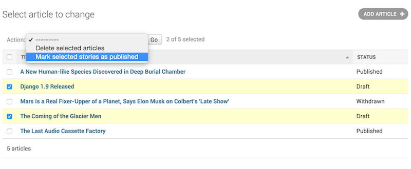

## 自定义Admin actions

通常情况下，admin的工作模式是“选中目标，然后修改目标”，但在同时修改大量目标的时候，这种模式就变得重复、繁琐。

为此，admin提供了自定义功能函数actions的手段，可以批量对数据进行修改。admin内置了一个批量删除对象的操作，如下图所示：

下面以一个新闻应用的文章模型为例，介绍一个批量更新的自定义actions，它将选择的文章由“草稿”状态更新为“发布”状态：

首先是模型的代码：
```python
from django.db import models

STATUS_CHOICES = (
    ('d', 'Draft'),
    ('p', 'Published'),
    ('w', 'Withdrawn'),
)

class Article(models.Model):
    title = models.CharField(max_length=100)
    body = models.TextField()
    status = models.CharField(max_length=1, choices=STATUS_CHOICES)

    def __str__(self):              # __unicode__ on Python 2
        return self.title
```

---

### 编写action

action必须携带三个参数：
    + 当前的ModelAdmin
    + 当前的HttpRequest对象（即request）
    + 被选择的对象（即QuerySet）
    
在应用中的admin.py文件中写入：
```python
def make_published(modeladmin, request, queryset):
    queryset.update(status='p')
```
注意：这里我们作为例子，简单地使用了queryset自带的update()方法，它能批量操作。但在多数情况下，你要自己遍历queryset的每个元素，并编写具体的操作。也就是：
```python
for obj in queryset:
    do_something_with(obj)
```
还可以设置一个简单易懂的简短描述(可以使用中文)，用于代替生硬的函数名：
```python
def make_published(modeladmin, request, queryset):
    queryset.update(status='p')
# 注意缩进，下面这句不在函数体内。
make_published.short_description = "Mark selected stories as published"
```

---

### 将自定义action添加到对应的ModelAdmin中

关键是其中的`actions = [make_published]`这句。
```python
from django.contrib import admin
from myapp.models import Article

def make_published(modeladmin, request, queryset):
    queryset.update(status='p')
make_published.short_description = "Mark selected stories as published"

class ArticleAdmin(admin.ModelAdmin):
    list_display = ['title', 'status']
    ordering = ['title']
    actions = [make_published]

admin.site.register(Article, ArticleAdmin)
```
然后，页面看起来是下面的样子（注意下拉框）：


处理错误：

这其中，如果你能够预知在自定义的操作中可能产生的错误，请处理该错误，并通过django.contrib.admin.ModelAdmin.message_user()以友好的方式给予用户提示信息。

---

### 三、将action定义为ModelAdmin的方法

上面的make_published看起来已经不错了，但是我们一般会将它作为ModelAdmin的方法来使用。下面我们把它移到ArticleAdmin类中：
```python
class ArticleAdmin(admin.ModelAdmin):
    ...

    actions = ['make_published']  # 请注意这里改成字符串引用了
    # 第一个参数变为self
    def make_published(self, request, queryset):
        queryset.update(status='p')
    make_published.short_description = "Mark selected stories as published"
```
这样做的好处是自定义方法可以直接访问类本身。例如下面使用self引用，为方法添加提示信息的功能：
```python
class ArticleAdmin(admin.ModelAdmin):
    ...

    def make_published(self, request, queryset):
        rows_updated = queryset.update(status='p')
        if rows_updated == 1:
            message_bit = "1 story was"
        else:
            message_bit = "%s stories were" % rows_updated
        self.message_user(request, "%s successfully marked as published." % message_bit)
```
回到浏览器，再试试，你会看到如下图所示（注意顶部的绿色提示行）：


---

### 四、跳转到中间页面

默认情况下，执行完actions后，浏览器会返回先前的修改列表页面。但有时候，一些复杂的action需要返回中间页面，例如内置的删除方法，在执行删除动作之前，会弹出一个删除确认页面。

要实现这个功能，只需要在action方法中返回一个HttpResponse（或它的子类）。 例如下面是一个利用Django内置的序列化函数将一个对象保存为json格式的范例：
```python
from django.http import HttpResponse
from django.core import serializers

def export_as_json(modeladmin, request, queryset):
    response = HttpResponse(content_type="application/json")
    serializers.serialize("json", queryset, stream=response)
    return response
```
多数情况下，我们会使用HttpResponseRedirect跳转到一个中间页面，并在GET方法的url中携带别选择的对象作为参数传递过去，然后在这个新的视图中接收这个参数，并编写具体的更加复杂的业务逻辑，如下面的代码所示：
```python
from django.contrib import admin
from django.contrib.contenttypes.models import ContentType
from django.http import HttpResponseRedirect

def export_selected_objects(modeladmin, request, queryset):
    # 获得被打钩的checkbox对应的对象
    selected = request.POST.getlist(admin.ACTION_CHECKBOX_NAME)
    # 获取对应的模型
    ct = ContentType.objects.get_for_model(queryset.model)
    # 构造访问的url，使用GET方法，跳转到相应的页面
    return HttpResponseRedirect("/export/?ct=%s&ids=%s" % (ct.pk, ",".join(selected)))
```
具体的业务views这里没有给出，作为练习，留给大家。

---

### 五、编写可用于整个admin站点的action

前面创建的actions智能应用于绑定的模型。实际上有时候，我们还需要可以对admin站点内所有模型都有效的acitons。上面写的`export_selected_objects`函数可以是一个很好的例子。要实现这一功能，你需要使用内置的`AdminSite.add_action`方法：`AdminSite.add_action(action, name=None)`
```python
from django.contrib import admin

admin.site.add_action(export_selected_objects)
```

---

### 六、禁用acitons

有时候，对于某些actions，我们想全局禁用或者局部禁用它。需要使用AdminSite.disable_action(name)方法。
    + 禁用全站级别的acitons：
例如，禁用内置的删除方法：
```python
admin.site.disable_action('delete_selected')
```
    + 全站禁用，但个别可用：在ModelAdmin.actions中显式地引用。
例如：
```python
# 全站禁用删除功能
admin.site.disable_action('delete_selected')

# 这个老老实实的被禁了
class SomeModelAdmin(admin.ModelAdmin):
    actions = ['some_other_action']
    ...

# 这个声明：我还要用
class AnotherModelAdmin(admin.ModelAdmin):
    actions = ['delete_selected', 'a_third_action']
    ...
```
    + 在指定模型中禁用所有actions：设置ModelAdmin.actions为None。（这会连带全局actions一起禁用了。）
    ```python
    class MyModelAdmin(admin.ModelAdmin):
        actions = None
    ```
    + 根据条件自动启用或禁用
    还可以根据条件自动选择性的启动或禁用某些acitons，你只需要改写ModelAdmin.get_actions()方法。该方法将返回一个包含actions的字典。字典的键是aciton的名字（也就是前面的'delete_selected', 'a_third_action'之类），值是一个元组，包含（函数、名字、别名）例如，允许用户名以“J”开头的用户批量删除对象，但其它用户不行：
    ```python
    class MyModelAdmin(admin.ModelAdmin):
    ...

    def get_actions(self, request):
        actions = super(MyModelAdmin, self).get_actions(request)
        if request.user.username[0].upper() != 'J':
            if 'delete_selected' in actions:
                del actions['delete_selected']
        return actions
    ```